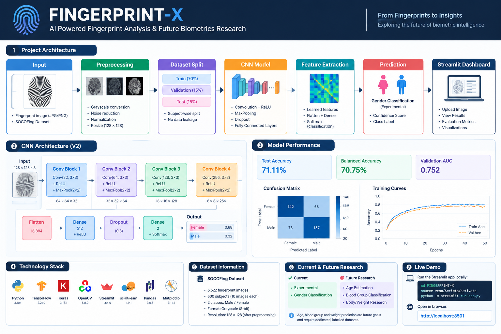

# 🧬 FINGERPRINT-X

### AI Biometric Intelligence Platform

> An experimental deep-learning platform for fingerprint image analysis and biometric research.

---

## 🚀 Overview

**FINGERPRINT-X** is an experimental AI research project that explores how deep-learning models can analyze fingerprint images and extract meaningful biometric patterns.

The platform combines **Computer Vision, CNNs, TensorFlow/Keras, OpenCV and Streamlit** into an interactive research prototype.

The current system focuses on building and validating the complete pipeline:

**Fingerprint Image → Preprocessing → CNN → Experimental Inference → Interactive Dashboard**

---

## ✨ Features

- 🖐️ Fingerprint image upload
- 🧹 Image preprocessing
- ⚫ Grayscale conversion
- 🔍 CLAHE-based image enhancement
-〽️ Ridge extraction
- 🧠 CNN-based deep-learning inference
- 📊 Experimental model evaluation
- 🖥️ Interactive Streamlit dashboard
- 📁 Structured research pipeline
- 🔬 Future biometric research modules

---

## 🧠 System Architecture



```text
                Fingerprint Image
                       │
                       ▼
              Image Preprocessing
                       │
                       ▼
              Grayscale Conversion
                       │
                       ▼
               CLAHE Enhancement
                       │
                       ▼
                 128 × 128 Input
                       │
                       ▼
                 CNN Model
                       │
                       ▼
              Feature Extraction
                       │
                       ▼
             Experimental Inference
                       │
                       ▼
             Streamlit Dashboard
